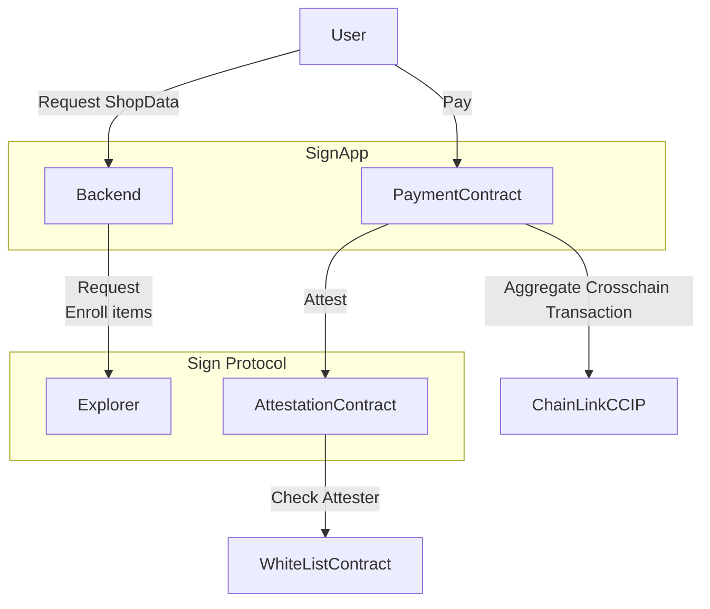

# For ETH Online 2024

## About
The project Unbound Sign is a transaction platform that makes all product transactions verifiable. It supports contracts and hooks compatible with Sign Protocol Attestations deployed across multiple chains to handle all necessary transactions, such as listings, purchases, and resales. This creates a world where only transparent, verifiable, and visualized transactions exist for everyone.

Naturally, the results of multi-chain transactions are managed on a single screen, avoiding fragmentation. Payment results from each chain are transferred to other chains through cross-chain payments, simplifying complex payment operations and expanding use cases.

To accommodate various use cases, the schema is designed flexibly, allowing attestations to be linked. This enables the handling of complex structures, similar to databases, which were previously difficult to represent on-chain.

## How it is made
The application primarily utilizes:

- Sign Protocol
- ChainLink CCIP

The demo site represents a multi-chain e-commerce platform. All data structures are expressed using the Sign Protocol’s schema.

Each product has its own schema, and the product itself is represented by an Attestation. Purchases also have a dedicated schema, which is likewise represented by an Attestation. These Attestations are linked through a LinkedAttestation relationship, designed to be useful for future queries.

In the purchase process, when the specified token is sent to the Payment Contract, it references the product’s Attestation. If it confirms that the paid amount exceeds the required price, the payment is transferred to the destination specified in the Attestation, and a new Attestation proving the ownership of the product is created, indicating the completion of the purchase.

Not only does it create an Attestation, but it also uses Hooks to ensure that only transactions audited by addresses on the whitelist (in this case, the Payment Contract) can create Attestations.

The transferred tokens are sent to a predetermined chain using ChainLink CCIP, allowing the design to align with the organization’s operations.

## Architecture

